# 🌍 EcoPulse - Climate Impact Simulation Platform

[](https://nextjs.org/)
[](https://www.typescriptlang.org/)
[](https://reactjs.org/)
[](https://threejs.org/)
[](https://tailwindcss.com/)

> **An interactive 3D globe simulation that demonstrates the environmental impact of human actions on our planet. Explore climate change scenarios and understand the consequences of environmental decisions through an engaging, educational experience.**

### 🛠️ **Technology Stack Overview**


## 📖 Table of Contents

- [🌟 Features](#-features)
- [🎯 Project Overview](#-project-overview)
- [🚀 Quick Start](#-quick-start)
- [🛠️ Installation](#️-installation)
- [📁 Project Structure](#-project-structure)
- [🎮 How to Use](#-how-to-use)
- [🔧 Technical Architecture](#-technical-architecture)
- [📊 Environmental Data](#-environmental-data)
- [🎨 UI/UX Design](#-uiux-design)
- [🤖 AI Integration](#-ai-integration)
- [🌐 API Documentation](#-api-documentation)
- [🧪 Development](#-development)
- [🚀 Deployment](#-deployment)
- [🤝 Contributing](#-contributing)
- [📄 License](#-license)
- [🙏 Acknowledgments](#-acknowledgments)

## 🌟 Features

### 🌍 **Interactive 3D Earth Visualization**
- **Realistic Earth Globe**: High-resolution textures with proper lighting and atmosphere
- **Population Visualization**: Dynamic dots showing human, animal, and plant populations
- **Environmental Effects**: Pollution particles, temperature waves, and atmospheric changes
- **Special Events**: Meteor impacts, nuclear explosions, volcanic eruptions, and divine interventions
- **Interactive Controls**: Orbit, zoom, and rotate with smooth animations

### 📊 **Real-Time Environmental Metrics**
- **CO₂ Levels**: Atmospheric carbon dioxide concentration (0-2000 ppm)
- **Air Toxicity**: Air pollution and toxicity levels (0-100%)
- **Global Temperature**: Average global temperature (-50°C to 50°C)
- **Population Tracking**: Human, animal, and plant population counts
- **Ocean Health**: pH levels and acidification monitoring
- **Ice Cap Status**: Melting percentage and polar ice coverage

### 🎯 **Educational Command System**
- **Positive Actions**: Renewable energy, reforestation, electric vehicles, ocean cleanup
- **Negative Actions**: Deforestation, industrial pollution, fossil fuel burning
- **Catastrophic Events**: Nuclear war, meteor impacts, volcanic eruptions, moon collision
- **Impact Analysis**: Detailed explanations of environmental consequences
- **Smart Suggestions**: AI-powered command recommendations with visual indicators

### 🎨 **Modern UI/UX Design**
- **Glass-morphism Interface**: Beautiful backdrop blur effects and transparency
- **Responsive Layout**: Works seamlessly on desktop, tablet, and mobile devices
- **Dark Theme**: Optimized for extended use with reduced eye strain
- **Smooth Animations**: Fluid transitions and interactive feedback
- **Accessibility**: High contrast, readable fonts, and keyboard navigation support

### 🤖 **AI-Powered Analysis**
- **Ollama Integration**: Local AI models for environmental impact analysis
- **Mock Data System**: Comprehensive fallback with realistic environmental scenarios
- **Smart Fallbacks**: Works perfectly even without AI backend
- **Multiple Models**: Support for various AI models (Llama, DeepSeek, Qwen)

## 🎯 Project Overview

EcoPulse is an educational climate simulation platform that combines cutting-edge web technologies with environmental science to create an engaging learning experience. The platform allows users to input environmental actions and see their real-time impact on a beautiful 3D Earth model.

### 🎓 **Educational Mission**
- **Raise Awareness**: Help users understand the environmental impact of human actions
- **Promote Sustainability**: Encourage positive environmental behaviors and decisions
- **Interactive Learning**: Make environmental education engaging and memorable
- **Data-Driven Insights**: Provide scientifically-based impact calculations

### 🔬 **Scientific Foundation**
- **Environmental Science**: Based on real climate and environmental research
- **Realistic Modeling**: Accurate representations of environmental processes
- **Data Sources**: NASA, NOAA, WHO, IPCC, and other authoritative sources
- **Regional Analysis**: Global and regional environmental data and trends

## 🚀 Quick Start

### Prerequisites
- **Node.js** 18.0 or later
- **npm** 9.0 or later
- **Git** for version control

### One-Command Setup
```bash
git clone https://github.com/yourusername/ecopulse.git
cd ecopulse/nextjs-app
npm install
npm run dev
```

Open [http://localhost:3000](http://localhost:3000) in your browser to see the application.

## 🛠️ Installation

### 1. **Clone the Repository**
```bash
git clone https://github.com/yourusername/ecopulse.git
cd ecopulse
```

### 2. **Install Dependencies**
```bash
cd nextjs-app
npm install
```

### 3. **Environment Setup**
Create a `.env.local` file in the `nextjs-app` directory:
```env
# Optional: Ollama API Configuration
OLLAMA_BASE_URL=http://127.0.0.1:11434
DEFAULT_MODEL=llama3.2:1b

# Optional: Analytics and Monitoring
NEXT_PUBLIC_ANALYTICS_ID=your_analytics_id
```

### 4. **Start Development Server**
```bash
npm run dev
```

### 5. **Optional: Ollama Setup (for AI features)**
```bash
# Install Ollama (macOS)
brew install ollama

# Install a model
ollama pull llama3.2:1b

# Start Ollama server
ollama serve
```## 📁 Project Structure

```
ecopulse/
├── nextjs-app/                    # Main Next.js application
│   ├── app/                       # App Router directory
│   │   ├── api/                   # API routes
│   │   │   └── process-command/   # Environmental impact analysis endpoint
│   │   ├── globals.css           # Global styles and animations
│   │   ├── layout.tsx            # Root layout component
│   │   └── page.tsx              # Main application page
│   ├── components/               # React components
│   │   ├── Globe.tsx            # 3D Earth visualization component
│   │   └── MetricsPanel.tsx     # Environmental metrics display
│   ├── lib/                     # Utility libraries and data
│   │   ├── mockData.ts          # Comprehensive environmental scenarios
│   │   └── mockHooks.ts         # Mock data hooks and utilities
│   ├── public/                  # Static assets
│   │   └── global-datacenter-visualization/
│   │       └── src/             # Earth texture assets
│   ├── package.json             # Dependencies and scripts
│   ├── tailwind.config.js       # Tailwind CSS configuration
│   └── tsconfig.json            # TypeScript configuration
├── nix/                         # Nix development environment
│   ├── nixos-module.nix        # NixOS module configuration
│   └── package.nix             # Package definition
├── flake.nix                   # Nix flake configuration
├── flake.lock                  # Nix flake lock file
└── README.md                   # This file
```

## 🎮 How to Use

### 🌍 **Basic Navigation**
1. **Explore the Globe**: Use mouse to orbit, scroll to zoom, click and drag to rotate
2. **View Metrics**: Check the right panel for real-time environmental data
3. **Input Commands**: Type environmental actions in the command input field
4. **Try Examples**: Click on suggested actions to see their impact

### 🎯 **Command Categories**

#### ✅ **Positive Actions**
- `"Build 100 renewable energy plants"` - Deploy clean energy infrastructure
- `"Plant 1 million trees worldwide"` - Large-scale reforestation
- `"Switch to electric vehicles globally"` - Transportation electrification
- `"Clean up ocean plastic waste"` - Marine pollution cleanup
- `"Implement carbon capture technology"` - Direct air capture systems

#### ⚠️ **Negative Actions**
- `"Build 1000 coal power plants"` - Expand fossil fuel infrastructure
- `"Cut down the Amazon rainforest"` - Mass deforestation
- `"Release 50 million tons of CO2"` - Massive greenhouse gas emissions
- `"Dump nuclear waste in the ocean"` - Marine contamination

#### 💥 **Catastrophic Events**
- `"Smash a meteor into Earth"` - Asteroid impact simulation
- `"Start a nuclear war"` - Global nuclear conflict
- `"Crash the moon into Earth"` - Lunar collision event
- `"Erupt all volcanoes simultaneously"` - Global volcanic eruption

#### ✨ **Special Events**
- `"God saves the Earth"` - Divine environmental restoration

### 📊 **Understanding Metrics**

| Metric | Range | Description |
|--------|-------|-------------|
| CO₂ Level | 0-2000 ppm | Atmospheric carbon dioxide concentration |
| Air Toxicity | 0-100% | Air pollution and toxicity levels |
| Temperature | -50°C to 50°C | Global average temperature |
| Human Population | 0+ | Total human population count |
| Animal Population | 0+ | Total animal population count |
| Plant Population | 0+ | Total plant population count |
| Ocean pH | 6.0-9.0 | Ocean acidity level |
| Ice Melting | 0-100% | Percentage of polar ice melted |
| Pollution Level | 0-100% | Overall environmental pollution |

### 🎮 **Interactive Features**
- **Auto-Simulation**: Toggle continuous environmental degradation
- **Reset Earth**: Restore Earth to pristine condition
- **Command History**: View recent environmental actions and their impacts
- **AI Analysis**: Real-time environmental impact analysis
- **Visual Effects**: Dynamic particles, atmosphere changes, and special events

## 🔧 Technical Architecture

### 🏗️ **System Architecture Overview**


### 🏗️ **Frontend Architecture**
- **Next.js 14**: App Router with React Server Components
- **TypeScript**: Full type safety and enhanced developer experience
- **Three.js**: 3D graphics and WebGL rendering
- **React Three Fiber**: React integration for Three.js
- **Tailwind CSS**: Utility-first CSS framework
- **Framer Motion**: Smooth animations and transitions

### 🧩 **React Component Architecture**

```mermaid
graph TD
    A[App.tsx] --> B[Layout.tsx]
    B --> C[Page.tsx]
    C --> D[Globe.tsx]
    C --> E[MetricsPanel.tsx]
    C --> F[AccessibilityPanel.tsx]
    C --> G[EducationalPanel.tsx]
    C --> H[LovableAdmin.tsx]
    
    D --> I[Earth Component]
    D --> J[Population Dots]
    D --> K[Particle Systems]
    D --> L[Special Effects]
    
    E --> M[CO₂ Display]
    E --> N[Temperature Gauge]
    E --> O[Population Counters]
    E --> P[Ocean Health]
    
    I --> Q[Texture Loading]
    I --> R[Lighting Setup]
    I --> S[Orbit Controls]
    
    style D fill:#ff6b6b
    style E fill:#4ecdc4
    style I fill:#ffa726
    style Q fill:#66bb6a
```



### 🎨 **3D Graphics Pipeline**


- **WebGL Rendering**: Hardware-accelerated 3D graphics
- **Texture Mapping**: High-resolution Earth textures with bump and specular maps
- **Lighting System**: Dynamic lighting with ambient and directional sources
- **Particle Systems**: Pollution particles, temperature waves, and atmospheric effects
- **Post-Processing**: Bloom effects and atmospheric scattering

### 🤖 **AI Integration**
- **Ollama**: Local AI model inference
- **Model Support**: Llama 3.2, DeepSeek R1, Qwen models
- **Fallback System**: Comprehensive mock data when AI is unavailable
- **Prompt Engineering**: Specialized prompts for environmental analysis

### 📊 **Data Management**
- **Mock Data System**: 50+ environmental scenarios with realistic impact calculations
- **Regional Data**: Global and regional environmental metrics
- **Real-time Updates**: Dynamic metric calculations and visualizations
- **Data Validation**: Input sanitization and boundary checking

## 📊 Environmental Data

### 🌍 **Global Metrics**
- **Baseline Values**: Pre-industrial environmental conditions
- **Current Values**: Real-time environmental state
- **Impact Calculations**: Scientifically-based environmental modeling
- **Trend Analysis**: Historical and projected environmental changes

### 📈 **Scenario Database**
- **15+ Environmental Scenarios**: Comprehensive coverage of environmental actions
- **Impact Categories**: Positive, negative, neutral, and catastrophic events
- **Duration Analysis**: Immediate, short-term, medium-term, and long-term impacts
- **Regional Effects**: Global and regional environmental consequences

### 🔬 **Scientific Sources**
- **Climate Data**: NASA, NOAA, IPCC climate research
- **Biodiversity**: IPBES, IUCN species and ecosystem data
- **Air Quality**: WHO, EPA air pollution standards
- **Energy**: IEA, IRENA renewable energy statistics
- **Ocean Health**: NOAA, UNEP marine ecosystem data

## 🎨 UI/UX Design

### 🎨 **Design System**
- **Color Palette**: Dark theme with green/blue environmental accents
- **Typography**: Inter font family for optimal readability
- **Spacing**: Consistent 4px grid system
- **Components**: Reusable UI components with consistent styling

### 🌟 **Visual Effects**
- **Glass-morphism**: Backdrop blur effects and transparency
- **Gradients**: Subtle color transitions and atmospheric effects
- **Animations**: Smooth transitions and micro-interactions
- **Particles**: Dynamic environmental effect visualization

### 📱 **Responsive Design**
- **Mobile-First**: Optimized for mobile devices
- **Breakpoints**: Tailwind CSS responsive utilities
- **Touch Support**: Gesture-based navigation for mobile
- **Performance**: Optimized rendering for various screen sizes
## 🤖 AI Integration

### 🧠 **AI Processing Pipeline**


### 🧠 **Supported Models**
- **Llama 3.2 (1B)**: Fast, efficient model for quick responses
- **DeepSeek R1 (8B)**: Advanced reasoning model for detailed analysis
- **Qwen3 (8B)**: Multilingual model with environmental expertise

### 🔧 **Configuration**
```typescript
// API Configuration
const ollamaConfig = {
  baseUrl: 'http://127.0.0.1:11434',
  model: 'llama3.2:1b',
  timeout: 30000,
  fallbackEnabled: true
};
```

### 📝 **Prompt Engineering**
- **Environmental Context**: Specialized prompts for climate analysis
- **Impact Categories**: Different prompts for various event types
- **Output Format**: Structured JSON responses with validation
- **Error Handling**: Graceful fallbacks and error recovery

## 🌐 API Documentation

### 🔄 **Data Flow Architecture**


### 📡 **Process Command Endpoint**

#### `POST /api/process-command`

Analyzes environmental impact of user commands.

**Request Body:**
```json
{
  "command": "Plant 1 million trees worldwide",
  "currentMetrics": {
    "co2Level": 415,
    "toxicityLevel": 5,
    "temperature": 30,
    "humanPopulation": 9000000000,
    "animalPopulation": 100000000000,
    "plantPopulation": 1000000000000,
    "oceanAcidity": 8.1,
    "iceCapMelting": 10
  },
  "pollutionLevel": 0,
  "model": "llama3.2:1b"
}
```

**Response:**
```json
{
  "analysis": "Planting 1 million trees will significantly reduce CO2 levels and improve air quality...",
  "metrics": {
    "co2Level": 365,
    "toxicityLevel": 0,
    "temperature": 29.7,
    "humanPopulation": 9010000000,
    "animalPopulation": 101000000000,
    "plantPopulation": 1050000000000,
    "oceanAcidity": 8.12,
    "iceCapMelting": 9
  },
  "pollutionLevel": -10,
  "specialEvent": null
}
```

### 🔄 **Error Handling**
- **400 Bad Request**: Invalid input parameters
- **500 Internal Server Error**: Processing errors with detailed messages
- **Timeout**: 30-second timeout with fallback responses

## 🧪 Development

### 🛠️ **Development Setup**
```bash
# Install dependencies
npm install

# Start development server
npm run dev

# Run type checking
npm run type-check

# Run linting
npm run lint

# Build for production
npm run build
```

### 🧪 **Testing**
```bash
# Run tests (when implemented)
npm run test

# Run tests in watch mode
npm run test:watch

# Run tests with coverage
npm run test:coverage
```

### 🔧 **Code Quality**
- **ESLint**: Code linting with Next.js and TypeScript rules
- **Prettier**: Code formatting (when configured)
- **TypeScript**: Strict type checking
- **Husky**: Git hooks for code quality (when configured)

### 📦 **Dependencies**

#### **Production Dependencies**
- `next`: 14.0.0 - React framework
- `react`: ^18 - UI library
- `react-dom`: ^18 - DOM rendering
- `three`: ^0.178.0 - 3D graphics library
- `@react-three/fiber`: ^8.15.0 - React Three.js integration
- `@react-three/drei`: ^9.88.0 - Three.js helpers
- `lucide-react`: ^0.292.0 - Icon library
- `framer-motion`: ^10.16.0 - Animation library

#### **Development Dependencies**
- `typescript`: ^5 - Type checking
- `@types/node`: ^20 - Node.js types
- `@types/react`: ^18 - React types
- `@types/react-dom`: ^18 - React DOM types
- `@types/three`: ^0.178.0 - Three.js types
- `tailwindcss`: ^3.3.0 - CSS framework
- `eslint`: ^8 - Code linting
- `eslint-config-next`: 14.0.0 - Next.js ESLint config

## 🚀 Deployment

### 🏗️ **Deployment Architecture**


### 🌐 **Vercel Deployment (Recommended)**
```bash
# Install Vercel CLI
npm i -g vercel

# Deploy to Vercel
vercel

# Deploy to production
vercel --prod
```

### 🐳 **Docker Deployment**
```dockerfile
# Dockerfile
FROM node:18-alpine

WORKDIR /app
COPY package*.json ./
RUN npm ci --only=production

COPY . .
RUN npm run build

EXPOSE 3000
CMD ["npm", "start"]
```

```bash
# Build Docker image
docker build -t ecopulse .

# Run container
docker run -p 3000:3000 ecopulse
```

### ☁️ **Other Platforms**
- **Netlify**: Static site deployment
- **AWS Amplify**: Full-stack deployment
- **Google Cloud Run**: Container deployment
- **Heroku**: Simple deployment with Procfile

### 🔧 **Environment Variables**
```env
# Production Environment Variables
NEXT_PUBLIC_APP_URL=https://ecopulse.vercel.app
OLLAMA_BASE_URL=https://your-ollama-instance.com
DEFAULT_MODEL=llama3.2:1b
NEXT_PUBLIC_ANALYTICS_ID=your_analytics_id
```
## 🤝 Contributing

We welcome contributions to EcoPulse! Here's how you can help:

### 🐛 **Reporting Issues**
1. Check existing issues before creating a new one
2. Use the issue template with detailed information
3. Include steps to reproduce and expected behavior
4. Attach screenshots or logs when relevant

### 💡 **Feature Requests**
1. Describe the feature and its benefits
2. Explain how it fits with the project's mission
3. Consider implementation complexity and maintainability
4. Provide mockups or examples when possible

### 🔧 **Code Contributions**
1. Fork the repository
2. Create a feature branch (`git checkout -b feature/amazing-feature`)
3. Make your changes with proper documentation
4. Add tests for new functionality
5. Ensure all tests pass and code quality checks
6. Commit your changes (`git commit -m 'Add amazing feature'`)
7. Push to the branch (`git push origin feature/amazing-feature`)
8. Open a Pull Request

### 📋 **Contribution Guidelines**
- **Code Style**: Follow existing code patterns and ESLint rules
- **Documentation**: Update README and code comments
- **Testing**: Add tests for new features and bug fixes
- **Performance**: Consider performance implications of changes
- **Accessibility**: Ensure changes are accessible to all users

### 🎯 **Areas for Contribution**
- **Environmental Data**: Add more scenarios and scientific data
- **3D Graphics**: Enhance visual effects and animations
- **AI Integration**: Improve prompt engineering and model support
- **Mobile Experience**: Optimize for mobile devices
- **Internationalization**: Add multi-language support
- **Performance**: Optimize rendering and data processing
- **Documentation**: Improve guides and API documentation

## 📄 License

This project is licensed under the MIT License - see the [LICENSE](LICENSE) file for details.

```
MIT License

Copyright (c) 2024 EcoPulse

Permission is hereby granted, free of charge, to any person obtaining a copy
of this software and associated documentation files (the "Software"), to deal
in the Software without restriction, including without limitation the rights
to use, copy, modify, merge, publish, distribute, sublicense, and/or sell
copies of the Software, and to permit persons to whom the Software is
furnished to do so, subject to the following conditions:

The above copyright notice and this permission notice shall be included in all
copies or substantial portions of the Software.

THE SOFTWARE IS PROVIDED "AS IS", WITHOUT WARRANTY OF ANY KIND, EXPRESS OR
IMPLIED, INCLUDING BUT NOT LIMITED TO THE WARRANTIES OF MERCHANTABILITY,
FITNESS FOR A PARTICULAR PURPOSE AND NONINFRINGEMENT. IN NO EVENT SHALL THE
AUTHORS OR COPYRIGHT HOLDERS BE LIABLE FOR ANY CLAIM, DAMAGES OR OTHER
LIABILITY, WHETHER IN AN ACTION OF CONTRACT, TORT OR OTHERWISE, ARISING FROM,
OUT OF OR IN CONNECTION WITH THE SOFTWARE OR THE USE OR OTHER DEALINGS IN THE
SOFTWARE.
```

## 🙏 Acknowledgments

### 🎓 **Educational Resources**
- **NASA Climate Change**: Global climate data and research
- **NOAA Environmental Information**: Ocean and atmospheric data
- **IPCC Reports**: Climate change assessment reports
- **WHO Air Quality Guidelines**: Health and environmental standards
- **UNEP Environmental Data**: Global environmental indicators

### 🛠️ **Technology Stack**
- **Next.js Team**: For the amazing React framework
- **Three.js Community**: For the powerful 3D graphics library
- **Vercel**: For seamless deployment and hosting
- **Tailwind CSS**: For the utility-first CSS framework
- **Ollama Team**: For local AI model inference

### 🎨 **Design Inspiration**
- **Environmental Visualizations**: Climate change data visualizations
- **Scientific Simulations**: Interactive science education tools
- **Modern UI/UX**: Contemporary web design patterns
- **Accessibility Guidelines**: WCAG compliance and inclusive design

### 🌍 **Environmental Organizations**
- **Climate Interactive**: Climate simulation tools and education
- **NASA Climate Kids**: Environmental education resources
- **National Geographic**: Environmental awareness and education
- **WWF**: Wildlife and environmental conservation

### 👥 **Contributors**
- **Core Team**: Main development and design team
- **Community Contributors**: Open source contributors and feedback
- **Beta Testers**: Early users who provided valuable feedback
- **Environmental Scientists**: Scientific advisors and data sources

---

## 📞 Support & Contact

- **GitHub Issues**: [Report bugs or request features](https://github.com/yourusername/ecopulse/issues)
- **Discussions**: [Join community discussions](https://github.com/yourusername/ecopulse/discussions)
- **Email**: [Contact the team](mailto:ecopulse@example.com)
- **Twitter**: [Follow for updates](https://twitter.com/ecopulse)
- **Discord**: [Join our community](https://discord.gg/ecopulse)

---

<div align="center">

**🌍 Made with ❤️ for a sustainable future**

[⭐ Star this repo](https://github.com/yourusername/ecopulse) • [🐛 Report Bug](https://github.com/yourusername/ecopulse/issues) • [💡 Request Feature](https://github.com/yourusername/ecopulse/issues) • [📖 Documentation](https://github.com/yourusername/ecopulse/wiki)

</div>
